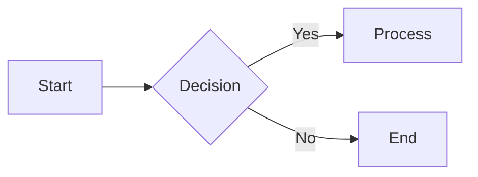

# Marp Preview

A Sublime Text plugin for real-time Marp slide preview.

- Auto-refreshes the browser preview on every save
- Renders custom CSS, images, and Mermaid diagrams — all offline
- **No Node.js, npm, or pre-installed marp command required**

## Requirements

- [Sublime Text 4](https://www.sublimetext.com/)
- Internet connection on first launch only — fully offline after that

## Installation

### Via Package Control (recommended)

1. Install [Package Control](https://packagecontrol.io/installation)
2. Open the Command Palette → **Package Control: Install Package**
3. Search for **MarpPreview** and press Enter

### Manual

Clone the repository and create a symlink in Sublime Text's Packages directory.

```bash
git clone https://github.com/astandkaya/MarpPreview.git ~/path/to/MarpPreview
```

**macOS**
```bash
ln -s ~/path/to/MarpPreview \
  ~/Library/Application\ Support/Sublime\ Text/Packages/MarpPreview
```

**Linux**
```bash
ln -s ~/path/to/MarpPreview \
  ~/.config/sublime-text/Packages/MarpPreview
```

**Windows** (PowerShell)
```powershell
New-Item -ItemType Junction -Path "$env:APPDATA\Sublime Text\Packages\MarpPreview" `
  -Target "C:\path\to\MarpPreview"
```

Restart Sublime Text to load the plugin.

## First-run downloads

On the first preview, the following files are automatically downloaded to `~/.marp-binary/`.

| File | Size | Purpose |
|------|------|---------|
| Marp CLI binary | ~60 MB | Markdown → slide rendering and export |
| mermaid.min.js | ~3.4 MB | Mermaid diagram preview in browser |

No internet connection is needed after the first run.

## Usage

### Open a preview

Open a `.md` file, then:

- Command Palette → **Marp: Open Preview**

To add a keyboard shortcut, open `Preferences > Key Bindings` and add:

```json
{ "keys": ["ctrl+shift+m"], "command": "marp_preview" }
```

### Live reload

The browser preview refreshes automatically every time you save.

### Export

Command Palette → **Marp: Export...** then choose a format.

| Format | Output |
|--------|--------|
| HTML | Single self-contained HTML file |
| PowerPoint | PPTX file |
| PDF | PDF file |

Output is saved in the same directory as the `.md` file.

> **Files with Mermaid diagrams:** Export requires an internet connection to [mermaid.ink](https://mermaid.ink). Preview continues to work offline.

> **PPTX / PDF:** Marp CLI uses its bundled Chromium, so the first export may take a moment.

### Stop preview

Command Palette → **Marp: Stop Preview**

## Features

### Custom theme CSS

```markdown
---
marp: true
---

<style>
@import url('./themes/my-theme.css');
</style>
```

`@import url()` in CSS files and any `url()` image references inside them are automatically inlined.

### Background images

```markdown

```

Local images are converted to data URIs and served inline.

### Mermaid diagrams

````markdown

````

| Context | Rendering |
|---------|-----------|
| Preview | In-browser via mermaid.min.js (local, offline) |
| Export | Via mermaid.ink API (internet required) |

Diagrams are scaled to fit within 900×500 px.

### Mermaid size adjustment

Preview targets `.mermaid-diagram svg`; export targets `.mermaid-export`.

```markdown
<style>
/* Preview */
.mermaid-diagram svg { max-width: 600px; }

/* Export */
.mermaid-export { width: 600px !important; }
</style>
```

## Settings

`Preferences > Package Settings > MarpPreview > Settings`

| Key | Default | Description |
|-----|---------|-------------|
| `marp_command` | `null` | `null` uses the auto-downloaded binary. Set to `"marp"` or `["npx", "@marp-team/marp-cli"]` to use an external command. |
| `server_port` | `8742` | Port for the local preview HTTP server. |

## Updating the binary

Delete `~/.marp-binary/` and the files will be re-downloaded on the next launch.

```bash
rm -rf ~/.marp-binary
```

## License

This plugin is released under the MIT License.

The following software downloaded at runtime is also MIT licensed:

- [Marp CLI](https://github.com/marp-team/marp-cli) © marp-team
- [Mermaid](https://github.com/mermaid-js/mermaid) © Knut Sveidqvist
